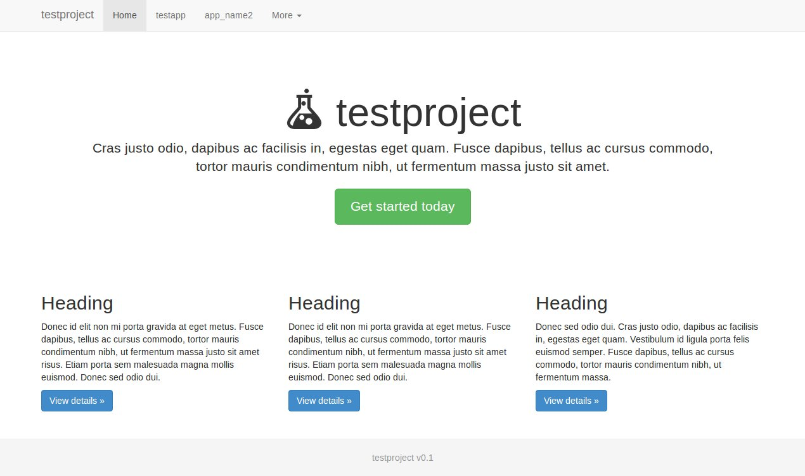

django-quick-start-project
==================

This is a Django project template to help you get up and running quick.

The django-quick-start project builds on [Django](https://www.djangoproject.com/) 1.5, [jQuery](http://jquery.com/) 1.10, and [Bootstrap](http://getbootstrap.com/) 3.0. Unlike other Django templates like [Pinax](http://pinaxproject.com/), django-quick-start is much more lightweight. A key design goal here was to have all of the templates that build the set present within the project (in contrast to Pinax.) This makes it easier to understand how your entire page is built and makes changing things easier.
It includes jquery and bootstrap, but does not depend on any other Django apps. This means all of the code that makes your site is contained in your project directory (unlike pinax where even the core code is hidden across multiple apps.)

# Setup

This setup sequence has been tested on Ubuntu 12.04. If you'd like, you can set up a virtual environment. Otherwise, skip those steps.

    sudo apt-get install python-pip
    #pip install virtualenv
    #virtualenv djangoenv
    #source djangoenv/bin/activate
    pip install Django==1.5

Start your new project by running the command below. Be sure to replace site_name with the name of your new website. (If you happen to set Django up through apt, you might not need the .py for django-admin.)

    django-admin.py startproject --template=https://github.com/joshvillbrandt/django-quick-start-project/archive/master.zip --extension=py,html site_name

# Get to work

So what do you really get with this Django project? You primarily get a bootstrap base.html template and a home.html template. There are also a lot of other minor details already filled out for you. You can see all of this in action by starting the development server like so:

    cd site_name
    python manage.py syncdb
    python manage.py runserver 0.0.0.0:8080

It should look something like this:

Your next step should be to setup an app (see [django-quick-start-app](http://github.com/joshvillbrandt/django-quick-start-app).) Your app templates can then extend the base.html template just as the home page does.

# Behing the scenes

Unlike a normal Django project, this project template registers itself as an app in your project's settings. This means you can store models and views inside of the project_name folder. But you probably shouldn't go crazy with models here... The rational behind this is to provide the site shell in the project_name folder. However, large features of your website still deserve their own app as Django intends. This method continues to promote app reusability without the need to create another application just to hold your site's shell.

# Extra 

I find it helpful to add the following aliases to my ~/.bashrc file. They are extra helpful when testing multiple Django instances simultaneously!

    alias rs1='python manage.py runserver 0.0.0.0:8001'
    alias rs2='python manage.py runserver 0.0.0.0:8002'
    alias rs3='python manage.py runserver 0.0.0.0:8003'
